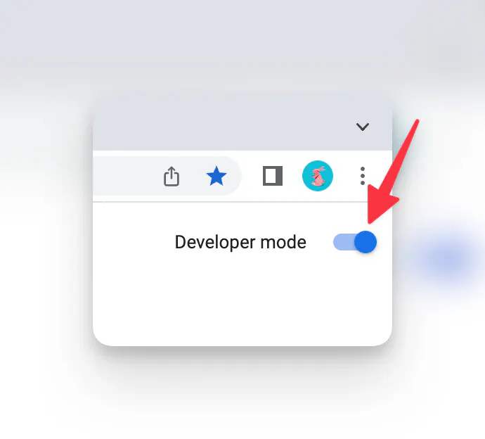

## README: Enhanced Version

---

### 📌 Table of Contents
1. [Introduction](#introduction)
2. [Getting Started](#getting-started)
3. [Architecture Overview](#architecture-overview)
4. [Production Build](#production-build)
5. [Running in Chrome](#running-in-chrome)
6. [Contributing](#contributing)
7. [Running Local Llama](#running-local-llama)
8. [Tech Stack](#tech-stack)

---

### 🌟 Introduction
Welcome Developers and Contributors! This README is designed to provide a structured guide to help you dive into this project seamlessly.

---

### 🚀 Getting Started – 3 steps

#### Pre-requisites
- Ensure you have `pnpm` installed.

#### 1. Installation and Running of the endponoint (internal requirement)
```bash
# go to api-endpoint folder
cd api-endpoint

# Install dependencies
pnpm install

# Start the development server
pnpm run dev
```

🌐 **API streaming server is ready**: This is a core of streaming outputs directly from LLM model into API based version!


#### 2. Chrome extension set up!
```bash
# go to chrome extension folder
cd chatwithpage-extension

# Install dependencies
pnpm install

# Get a build of the chrome extension ready
pnpm build
```
📂 **Output Directory**: All production files will be located in the `build` folder.


### 3.  🐪 Running Local Llama

#### Steps:
1. **Model Installation**: Go to [ollama.ai](https://ollama.ai/) and follow installation instructions.
2. **Run Model**: `ollama run mistral`
3. **Server Setup**: Install `litellm` via pip: `pip install litellm`
4. **Start Server**: 
   ```bash
   litellm --model ollama/mistral --api_base http://localhost:11434 --temperature 0.3 --max_tokens 2048
   ```


---

### 🖥 Installing extension in Chrome

1. **Navigate**: Go to `chrome://extensions`.
2. **Enable Developer Mode**.
3. **Load Extension**: Click "Load Unpacked" and navigate to `build/chrome-mv3-dev` or `build/chrome-mv3-prod`.



---

### 🤝 Contributing

#### Current To-Do List:
- Streamline local-stream repo.
- Ensure compatibility with Vercel AI and OpenAI npm modules.

---

### 💡 Tech Stack

This extension is proudly built with [Plasmo](https://docs.plasmo.com/).

---

📘 **Note**: Your collaboration is highly valued. Let's build something awesome together!

---

## Star History

[](https://star-history.com/#Fuzzy-Search/chat-with-page&Date)
